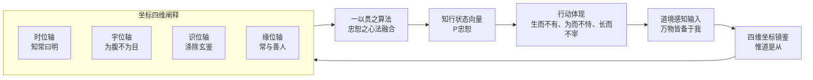

# 道境知行系统 & 袭明每日镜鉴 - 完整技术资料文档

> 整理时间: 2026-05-03
> 数据来源: DeepSeek对话历史 (conversations.json) + 项目代码文件
> 涉及对话编号: 176, 177, 178, 179, 187, 188, 196, 199, 201, 211, 212, 229, 233, 234, 238, 243, 244, 247, 255, 257, 276, 293, 317, 331, 340, 341, 342

---

## 目录

1. [系统总览](#一系统总览)
2. [道境知行系统 - 哲学框架](#二道境知行系统---哲学框架)
3. [四维坐标系统](#三四维坐标系统)
4. [P忠恕算法](#四p忠恕算法)
5. [五步协同读解法](#五五步协同读解法)
6. [袭明每日镜鉴 - 产品设计](#六袭明每日镜鉴---产品设计)
7. [技术架构与实现](#七技术架构与实现)
8. [数据模型与存储](#八数据模型与存储)
9. [道家AI伦理设计](#九道家ai伦理设计)
10. [道经镜鉴数据库](#十道经镜鉴数据库)
11. [Coze AI工作流集成](#十一coze-ai工作流集成)
12. [项目演进时间线](#十二项目演进时间线)
13. [关键文件索引](#十三关键文件索引)

---

## 一、系统总览

### 1.1 项目定位

**道境知行系统**是融合东方智慧（道家、儒家经典）与现代科技（AI、区块链、量子信息）的个人修行辅助体系。

**袭明每日镜鉴**是道境知行系统的产品化实现，以微信小程序为载体，通过AI对话与数据镜鉴，引导用户实现认知跃迁。

### 1.2 核心理念

| 层面 | 理念                           | 来源               |
| ---- | ------------------------------ | ------------------ |
| 道   | 万物同源、阴阳辩证、惟道是从   | 《道德经》         |
| 法   | 破分别心、行观复法、持中道镜   | 道德经第27章"袭明" |
| 术   | 为无为、修玄德、行不言之教     | 道德经第2/10/51章  |
| 器   | 四维坐标、AI智能体、区块链存证 | 现代技术           |

### 1.3 名称溯源

**"袭明"** 出自《道德经》第27章：

> "是以圣人常善救人，故无弃人；常善救物，故无弃物。是谓袭明。"

- "袭"：承袭天道如穿衣般自然
- "明"：洞悉万物本质的智慧
- 圣人以天道之眼观世，见一切人/物皆有道性，故能"不救而救"

---

## 二、道境知行系统 - 哲学框架

### 2.1 系统总纲（道器合一）

来源: 对话176 → 179升级版

```
道境知行系统 = 道(本体) + 法(认知) + 术(实践) + 器(载体)
```

- **以道为体**：万物同源（"忠"之基）；阴阳辩证（"恕"之用）
- **以法为镜**：破分别心而行"恕"，观复万物而持"忠"，持中道而求"一贯"
- **以术为用**：为无为（忠恕为心法），修玄德（忠恕之极致），行不言之教（忠恕之自然流露）
- **以器为载**：四维坐标成为"忠恕之心"的延伸与镜鉴

### 2.2 一以贯之升级（对话179定稿）

升级核心：从**分析性框架** → **有灵魂的生命性修行系统**



### 2.3 验证体系（三重验证环）

| 验证层   | 指标           | 标准             |
| -------- | -------------- | ---------------- |
| 内在验证 | 心性提升度     | 识位轴清晰度增长 |
| 关系验证 | 缘位网络健康度 | 互惠性、多样性   |
| 效能验证 | 系统可持续性   | 时位轴熵减趋势   |

终极验证：
- 个人层面："从心所欲不逾矩"的体验频率
- 关系层面：缘位网络的"互惠性与共生性"健康度
- 系统层面："无弃人+无弃物"原则的实现度

---

## 三、四维坐标系统

### 3.1 完整定义

来源: 对话176(道境坐标系) + 对话150-155(孔老智慧罗盘) + 对话187(P忠恕)

| 维度       | 经典依据           | 核心心法       | 忠恕对应     |
| ---------- | ------------------ | -------------- | ------------ |
| **时位轴** | 反者道之动         | 知常曰明       | 忠于天道节律 |
| **宇位轴** | 天之道损有余补不足 | 为腹不为目     | 恕及资源分布 |
| **识位轴** | 涤除玄鉴           | 常无欲以观其妙 | 忠于本心明镜 |
| **缘位轴** | 天道无亲常与善人   | 善者吾善之     | 恕于一切因果 |

### 3.2 各轴详细规格

#### 时位轴 (Temporal - T)
- **核心算法**: 多尺度熵分析 + 相空间重构
- **实践心法**: 知常曰明 - 通过熵值变化判断行动时机
- **实践提问**: 我的行动是否"忠"于此时的势能趋势？
- **评分范围**: 1-10分
- **低分表现**: 逆势而动、急功近利、透支未来
- **高分表现**: 知进知退、应时而动、信任过程

#### 宇位轴 (Spatial - S)
- **核心算法**: 资源基尼系数 + 能量流拓扑分析
- **实践心法**: 为腹不为目 - 满足本质需求，节制过度消耗
- **实践提问**: 我的资源取舍是否体现了"恕"道？
- **评分范围**: 1-10分
- **低分表现**: 占有囤积、损不足而奉有余
- **高分表现**: 损有余而补不足、动态平衡

#### 识位轴 (Wisdom/Cognition - C)
- **核心算法**: 注意力网络分析 + 心念标记模型
- **实践心法**: 常无欲以观其妙 - 每个念头生起时觉知其空性
- **实践提问**: 我的起心动念，是否"忠"于观照本身？
- **评分范围**: 1-10分
- **低分表现**: 心随境转、杂念纷飞、纠结概念
- **高分表现**: 涤除玄鉴、心灵如明镜、直觉感知

#### 缘位轴 (Causality/Relation - R)
- **核心算法**: 因果信息几何 + 互惠网络动力学
- **实践心法**: 善者吾善之，不善者吾亦善之 - 平等对待所有缘起
- **实践提问**: 我在此因缘中，是否贯彻了"恕"道？
- **评分范围**: 1-10分
- **低分表现**: 自我中心、争论对错、人际紧张
- **高分表现**: 常与善人、和而不同、构建互惠网络

### 3.3 能位轴（第五维度 - 对话188）

```
能位轴 = 源(阳) <-> 汇(阴) 的能量流动状态
```

**五维架构公式**:
```
道境智慧 = 能位(能量) ⊗ [识位(信息) × 缘位(关系) × 宇位(空间) × 时位(时间)]
```

能位与四维的相互作用：
1. 能位→识位：能量分布决定认知精度
2. 能位→缘位：能量流动塑造关系网络
3. 能位→宇位：能量密度决定空间丰度
4. 能位→时位：能量节奏影响时间感知

---

## 四、P忠恕算法

### 4.1 定义

来源: 对话187(P忠恕终稿)

**P忠恕** = 在时空因缘的某一点上，生命所呈现出的、以"忠恕"为内核的**道德位置、精神姿态与成长潜能**。

它不是独立的第五维度，而是**贯穿并融合**了四维坐标的生命化解读。

### 4.2 计算公式

**基础公式** (产品版):
```
P忠恕_单事件分数 = (T * 0.2) + (S * 0.2) + (C * 0.3) + (R * 0.3)
```

其中：
- T = 时位轴分数 (1-10)
- S = 宇位轴分数 (1-10)
- C = 识位轴分数 (1-10)
- R = 缘位轴分数 (1-10)

**理论公式** (哲学版):
```
P忠恕 = nabla(能位忠) x nabla(能位恕) + sum(四维忠恕分量)
```

### 4.3 四维忠恕映射

| 维度 | 忠恕角色     | 低P忠恕表现 | 高P忠恕表现          |
| ---- | ------------ | ----------- | -------------------- |
| 时位 | 忠：尽己之心 | 逆势而动    | 知进知退，知存知亡   |
| 宇位 | 恕：推己及人 | 占有囤积    | 损有余而补不足       |
| 识位 | 忠：尽己之心 | 心随境转    | 涤除玄鉴，心灵如明镜 |
| 缘位 | 恕：推己及人 | 自我中心    | 常与善人，互惠网络   |

### 4.4 霍金斯能量层级映射

| P分范围 | 能量等级 | 颜色    | 描述   |
| ------- | -------- | ------- | ------ |
| 0-3     | 恐惧     | #FF6B6B | 需提升 |
| 3-5     | 欲望     | #FFA500 | 可改善 |
| 5-6     | 勇气     | #FFD700 | 中等   |
| 6-7     | 中立     | #90EE90 | 良好   |
| 7-8     | 主动     | #87CEEB | 良好+  |
| 8-9     | 宽容     | #DDA0DD | 优秀   |
| 9-10    | 平和     | #98FB98 | 卓越   |

### 4.5 5级颜色阶梯系统（可视化）

| 等级 | 分数范围 | 颜色值  | 描述   |
| ---- | -------- | ------- | ------ |
| 5    | 8.0-10.0 | #2E7D32 | 优秀   |
| 4    | 6.5-7.9  | #66BB6A | 良好   |
| 3    | 5.0-6.4  | #FFD54F | 中等   |
| 2    | 3.5-4.9  | #FFA726 | 可改善 |
| 1    | 2.0-3.4  | #FF6B6B | 需提升 |
| 0    | <2.0或无 | #CCCCCC | 无数据 |

---

## 五、五步协同读解法

### 5.1 完整流程定义

来源: 对话247(论语版) + 对话257(道德经版) + 对话276/293/317/342

五步协同读解法是道境知行系统的经典研读方法论，适用于《道德经》和《论语》等经典文本。

#### 第一步：文本细读与语义锚定
- 版本比对：多个传本比对（王弼本、帛书甲乙本、郭店楚简等）
- 字词溯源：关键词汇的原意与引申
- 句式辨析：语言结构分析
- 内证优先：与其他章节的内在呼应

#### 第二步：语境构建与哲学推演
- 微观语境：章内逻辑关系
- 中观语境：章际关系与前后呼应
- 宏观语境：在"道—德—万物"框架中的体系定位

#### 第三步：争议显化与诠释选项分析
- 主动揭示历代关键争议
- 陈列多元诠释选项
- 引用关键文献与出处

#### 第四步：逻辑一致性与体系兼容性校验
- 内部自洽：与全书内部是否一致
- 外部兼容：与其他哲学体系的相通与分异

#### 第五步：意义转化与现代启示提炼
- 历史具体义：原始语境中的含义
- 哲学普遍义：超越时代的普遍规律
- 情境迁移：转化为现代个人、组织、文明的启示

### 5.2 知识架构（三层）

| 层级   | 名称       | 描述                           |
| ------ | ---------- | ------------------------------ |
| 第一层 | 原文SPO层  | 原子事实，主体-谓词-客体三元组 |
| 第二层 | 概念释义层 | 哲学网络，系统化核心概念       |
| 第三层 | 现代实例层 | 智慧转化，连结现代生活场景     |

---

## 六、袭明每日镜鉴 - 产品设计

### 6.1 产品概要

| 项目     | 说明                                  |
| -------- | ------------------------------------- |
| 项目名称 | 袭明每日镜鉴                          |
| 项目类型 | 微信小程序 - 个人修行记录与成长助手   |
| 思想来源 | 《道德经》《论语》等中华经典          |
| 核心价值 | 基于P忠恕算法的个人修行记录与反思工具 |
| 技术特色 | 100%本地存储，保护用户隐私            |
| 版本状态 | v2.0-alpha                            |

### 6.2 核心功能模块 - "每日三镜"

#### 6.2.1 晨间定志 (Morning Intent)
- **输入**: 用户选择或输入当日修行意图
- **处理**: 系统记录意图，生成修行提醒
- **输出**: 展示意图 + 定志列表（历史检索）

#### 6.2.2 事件镜鉴 (Event Mirror) - 核心功能
- **输入**: 
  - 用户描述事件经过与感受（文本）
  - 四维度1-10分自评（滑动条）
- **处理**:
  1. 调用P忠恕计算器
  2. 映射到霍金斯能量精细对照表
  3. 确定能量层级，生成镜鉴
- **输出**:
  1. P忠恕分数
  2. 能量层级
  3. 镜鉴反馈
  4. 修行建议
  5. 保存当日记录

#### 6.2.3 晚间回顾 (Evening Reflection)
- 汇总当日数据
- 生成能量趋势图
- 师资转化反思
- 明日修行展望

#### 6.2.4 修行档案 (Profile)
- 可视化展示长期数据
- 成长轨迹分析
- 里程碑统计
- 数据导出功能

#### 6.2.5 数据管理 (Data Management)
- 数据备份/恢复
- 数据导出（JSON/CSV）
- 统计报表

### 6.3 实践系统闭环

| 时段 | 活动      | 维度   | 修行模式             |
| ---- | --------- | ------ | -------------------- |
| 晨课 | 观复·忠   | 识位轴 | 心灵明镜的纯粹观照   |
| 日课 | 中道·一贯 | 全维度 | 叩其两端寻忠恕平衡点 |
| 晚课 | 袭明·恕   | 缘位轴 | "无弃人"的恕道智慧   |

### 6.4 用户画像系统

动态生成9类用户画像，结合"阳"（行为指标）与"阴"（数据质量）：
- 例如："笃行的清明者"、"精进的砥砺者"等

### 6.5 特色设计

- **师资循环**: 将日常体验转化为修行智慧的反思过程
- **3个基础模板**: 晨起静坐、午间记录、晚间反省
- **每日日程限制**: 最多5个
- **批量操作**: 支持多日相同日程批量添加

---

## 七、技术架构与实现

### 7.1 技术栈

| 层面     | 技术                                        |
| -------- | ------------------------------------------- |
| 前端     | 微信小程序原生框架 (WXML, WXSS, JavaScript) |
| 后端     | Python Flask                                |
| 数据库   | SQLite (开发) / 云端数据库 (生产)           |
| AI集成   | Coze AI 工作流引擎                          |
| 云服务   | 微信云托管 (Docker容器)                     |
| 数据存储 | 100%本地存储 (wx.getStorageSync)            |

### 7.2 项目文件结构

```
袭明每日镜鉴/
├── miniprogram/                    # 微信小程序前端
│   ├── pages/
│   │   ├── index/                  # 首页
│   │   ├── morning/                # 晨间定志
│   │   ├── event_mirror/           # 事件镜鉴
│   │   ├── reflection/             # 晚间回顾
│   │   ├── reflection_list/        # 反思列表
│   │   ├── profile/                # 修行档案
│   │   ├── data_manage/            # 数据管理中心
│   │   ├── calendar/               # 修行日历
│   │   ├── daojing_mirror/         # 道经镜鉴
│   │   └── test_daojing/           # 道经测试
│   ├── components/
│   │   ├── chart/                  # 图表组件
│   │   ├── teacher-student-cycle/  # 师资循环
│   │   └── calendar/               # 日历组件
│   ├── utils/
│   │   ├── algorithm.js            # P忠恕算法
│   │   ├── dateUtil.js             # 日期工具
│   │   ├── dataService.js          # 数据服务
│   │   ├── scheduleService.js      # 日程服务
│   │   ├── colorGrade.js           # 颜色分级
│   │   ├── mockDataService.js      # 模拟数据
│   │   ├── api.js                  # API调用
│   │   └── daojing/                # 道经模块
│   │       ├── daojingAnalyzer.js  # 章节分析器
│   │       ├── daojingConstants.js # 常量定义
│   │       ├── daojingDataLoader.js# 数据加载器
│   │       ├── daojingMatcher.js   # 关键词匹配器
│   │       ├── daojingService.js   # 道经服务
│   │       └── daojingStorage.js   # 道经存储
│   ├── data/
│   │   └── daojing/
│   │       ├── daojing_mvp_database.json  # 道经镜鉴数据库
│   │       ├── daojing_chapters.json      # 章节索引
│   │       └── daojing_keyword_index.json # 关键词索引
│   ├── images/                     # 图标资源
│   ├── app.js                      # 入口文件
│   ├── app.json                    # 配置文件
│   └── app.wxss                    # 全局样式
├── backend/                        # Python后端
│   ├── app.py                      # 主应用
│   ├── config.py                   # 配置
│   ├── run.py                      # 启动脚本
│   └── requirements.txt            # 依赖
└── docs/
    ├── PROJECT_STRUCTURE.md         # 项目结构
    └── 道家AI伦理应用设计.md         # 伦理设计文档
```

### 7.3 核心算法实现

```javascript
/**
 * P忠恕分数计算
 * @param {Object} dimensionScores - {temporal, spatial, wisdom, causality}
 * @returns {Number} P忠恕分数 (0-10)
 */
function calculatePScore(dimensionScores) {
  const weights = {
    temporal: 0.2,     // 时位权重
    spatial: 0.2,      // 宇位权重
    wisdom: 0.3,       // 识位权重
    causality: 0.3     // 缘位权重
  };
  let pScore = 0;
  for (const [dim, weight] of Object.entries(weights)) {
    pScore += dimensionScores[dim] * weight;
  }
  return Math.round(pScore * 10) / 10;
}

/**
 * 霍金斯能量等级映射
 * @param {Number} pScore
 * @returns {Object} {name, color, level}
 */
function mapToHawkinsLevel(pScore) {
  const levels = [
    { range: [0, 3], name: '恐惧', color: '#FF6B6B' },
    { range: [3, 5], name: '欲望', color: '#FFA500' },
    { range: [5, 6], name: '勇气', color: '#FFD700' },
    { range: [6, 7], name: '中立', color: '#90EE90' },
    { range: [7, 8], name: '主动', color: '#87CEEB' },
    { range: [8, 9], name: '宽容', color: '#DDA0DD' },
    { range: [9, 10], name: '平和', color: '#98FB98' }
  ];
  for (const level of levels) {
    if (pScore >= level.range[0] && pScore < level.range[1]) {
      return level;
    }
  }
  return { name: '平和', color: '#98FB98' };
}

/**
 * 趋势计算 - 简单移动平均线
 * @param {Array<Number>} data
 * @param {Number} windowSize
 * @returns {Array<Number>}
 */
function calculateSimpleMovingAverage(data, windowSize = 3) {
  if (data.length < windowSize) return data;
  const result = [];
  for (let i = 0; i <= data.length - windowSize; i++) {
    const window = data.slice(i, i + windowSize);
    const avg = window.reduce((a, b) => a + b, 0) / windowSize;
    result.push(Math.round(avg * 10) / 10);
  }
  return result;
}
```

### 7.4 后端API接口

| 端点                | 方法 | 功能             |
| ------------------- | ---- | ---------------- |
| `/`                 | GET  | 服务状态检查     |
| `/api/health`       | GET  | 健康检查         |
| `/api/event/mirror` | POST | 事件镜鉴分析     |
| `/api/user/events`  | GET  | 获取用户事件历史 |
| `/api/data/export`  | POST | 数据导出         |
| `/api/data/backup`  | POST | 数据备份         |

#### 事件镜鉴API详情

```http
POST /api/event/mirror
Content-Type: application/json

请求体:
{
  "user_id": "user_123",
  "event_description": "事件描述文本",
  "dimension_scores": {
    "temporal": 8,
    "spatial": 7,
    "wisdom": 9,
    "causality": 8
  }
}

响应:
{
  "success": true,
  "p_zhongshu_score": 8.1,
  "hawkins_level": "主动区间",
  "ai_feedback": "深度分析文本",
  "practice_advice": "修行建议",
  "timestamp": "2026-01-30T10:30:00Z"
}
```

---

## 八、数据模型与存储

### 8.1 核心数据模型

```python
class ZhongShuEvent:
    event_id: str           # 事件唯一ID
    user_id: str            # 用户ID
    timestamp: datetime     # 时间戳
    event_description: str  # 事件描述
    dimension_scores: {
        'temporal': int,    # 时位轴分数 (1-10)
        'spatial': int,     # 宇位轴分数 (1-10)
        'wisdom': int,      # 识位轴分数 (1-10)
        'causality': int    # 缘位轴分数 (1-10)
    }
    p_zhongshu_score: float # P忠恕分数
    hawkins_level: str      # 霍金斯能量层级
    ai_feedback: str        # AI镜鉴文本
```

### 8.2 LocalStorage数据结构

```javascript
// 事件历史 (核心数据)
event_history = [{
  id: 'event_timestamp',
  description: '事件描述',
  timestamp: 'ISO时间戳',
  date: 'YYYY-MM-DD',
  scores: { temporal, spatial, wisdom, causality },
  pScore: 7.5,
  energyLevel: { name: '勇气', level: 200, color: '#FFD700' },
  aiFeedback: '反馈文本',
  practiceAdvice: '修行建议',
  recordType: 'real-time'  // 或 'retrospective'
}];

// 能量统计
energy_statistics = {
  '勇气': { count: 15, totalPScore: 110.5, avgPScore: 7.37 },
  '宽容': { count: 8, totalPScore: 68.5, avgPScore: 8.56 }
};

// 总体统计
overall_statistics = {
  totalEvents: 150,
  activeDaysCount: 45,
  avgPScore: 6.85,
  highestPScore: 9.5,
  lowestPScore: 2.3,
  lastUpdateTime: 'ISO',
  dataVersion: 1
};

// 全局日期同步
globalData: {
  currentDate: 'YYYY-MM-DD',
  lastUpdateTime: 0,
  globalDateListeners: [],
  dataVersion: 0
};
```

### 8.3 日期同步机制

```javascript
// app.js 全局日期管理
updateGlobalDate() → checkDateUpdate() → notifyDateChange()

// 各页面同步
onLoad()  → syncGlobalDate() + 注册监听器
onShow()  → syncGlobalDate() 每次显示时检查
onGlobalDateChange(newDate) → refreshData()
```

---

## 九、道家AI伦理设计

来源: 道家AI伦理应用设计.md

### 9.1 六大伦理原则

| 道家原则     | 模块对应 | 应用方式             |
| ------------ | -------- | -------------------- |
| 无为而无不为 | 事件镜鉴 | 最小介入，不强制记录 |
| 大巧若拙     | 界面设计 | 简洁朴素但功能完整   |
| 上善若水     | 用户画像 | 适应不同修行阶段     |
| 知者不言     | AI反馈   | 用经典语录而非说教   |
| 功成事遂     | 每日总结 | 让用户感到自然达成   |
| 柔弱胜刚强   | 反馈语气 | 温和鼓励，避免批判   |

### 9.2 AI反馈禁止事项

- 直接评价对错
- 使用"你应该"等命令式
- 过度解释AI分析过程
- 刷存在感
- 强制性提醒

### 9.3 用户阶段适配

| 阶段   | 反馈方式             |
| ------ | -------------------- |
| 初学者 | 引导式反馈，详细解释 |
| 修行者 | 精简反馈，鼓励探索   |
| 深入者 | 隐喻式反馈，启发思考 |

### 9.4 综合检查清单

| 原则 | 检查点               | 合格标准           |
| ---- | -------------------- | ------------------ |
| 无为 | 是否有不必要的推送？ | 用户不烦则合格     |
| 若拙 | 界面是否过于复杂？   | 一眼能懂则合格     |
| 若水 | 是否适应不同用户？   | 能调整则合格       |
| 不言 | 是否在说教？         | 语录代替评价则合格 |
| 事遂 | 是否让用户感到自然？ | 无"被帮助"感则合格 |
| 柔弱 | 语气是否温和？       | 无强硬词则合格     |

---

## 十、道经镜鉴数据库

来源: data/daojing/daojing_mvp_database.json (53KB)

### 10.1 数据结构

每章包含四轴的高/低维度镜鉴内容：

```json
{
  "章号": {
    "chapter_title": "章节标题",
    "dimensions": {
      "时位轴": {
        "低": {
          "triggers": ["触发关键词列表"],
          "insight_desc": "镜鉴洞察描述",
          "action_desc": "行动建议",
          "reflection": "反思问题"
        },
        "高": { /* 同上结构 */ }
      },
      "宇位轴": { "低": {...}, "高": {...} },
      "识位轴": { "低": {...}, "高": {...} },
      "缘位轴": { "低": {...}, "高": {...} }
    }
  }
}
```

### 10.2 示例（第1章）

**章名**: 道可道，非常道

| 维度   | 状态 | 触发词             | 镜鉴                               | 行动建议                                |
| ------ | ---- | ------------------ | ---------------------------------- | --------------------------------------- |
| 时位轴 | 低   | 可道、可名、困惑   | 正试图用固定概念捕捉不可言说的"道" | 暂停思考，观察呼吸1分钟，接纳"不知"状态 |
| 时位轴 | 高   | 无名、守中、静观   | 能安然处于概念空白处               | 练习静默倾听5分钟                       |
| 宇位轴 | 低   | 囤积知识、占有书本 | 通过占有文字知识填充自己           | 将一本已读书籍赠予他人                  |
| 宇位轴 | 高   | 分享感悟、知识流动 | 能将所学轻松分享流转               | 用一句话分享"不占有也快乐"的体验        |
| 识位轴 | 低   | 纠结概念、逻辑辨析 | 心识被念头和逻辑辨析紧紧抓住       | 轻声说"念头"，注意力回到呼吸            |
| 识位轴 | 高   | 内心安静、直觉感知 | 心如平静湖面                       | 静坐一分钟，允许念头来去                |
| 缘位轴 | 低   | 争论对错、说服他人 | 产生"我对你错"的分别               | 只说"谢谢你分享这个角度"                |
| 缘位轴 | 高   | 和而不同、倾听     | 安然与不同见解者共处               | 寻找非观点层面的共识                    |

### 10.3 配套工具模块

```
utils/daojing/
├── daojingAnalyzer.js    # 章节深度分析器
├── daojingConstants.js   # 常量和配置
├── daojingDataLoader.js  # 数据懒加载器
├── daojingMatcher.js     # 关键词匹配引擎
├── daojingService.js     # 镜鉴服务总线
└── daojingStorage.js     # 镜鉴历史存储
```

---

## 十一、Coze AI工作流集成

### 11.1 工作流架构

```
用户输入 → 事件解析节点 → 四维分析节点 → 智慧生成节点 → 输出格式化
```

### 11.2 Coze提示词框架

```
作为道境知行系统的AI镜鉴师，请深度分析以下事件：
【事件描述】：{event_description}
【四维评分】：时位({temporal}) 宇位({spatial}) 识位({wisdom}) 缘位({causality})
【能量层级】：{hawkins_level} (P忠恕分数：{p_zhongshu_score})

分析维度：
1. 情绪模式识别
2. 认知盲点发现
3. 成长机会挖掘
4. 修行路径建议

输出要求：
- 语气平和、充满智慧，具有东方哲学韵味
- 以"道境知行"系统的理念为基础
- 用经典语录而非说教
- 结合四维评分生成有深度、有启发的反馈
```

### 11.3 输出格式

```json
{
  "ai_feedback": "深度分析文本（含经典语录引用）",
  "practice_advice": "具体可行的修行建议",
  "insight_point": "核心洞见（一句话）"
}
```

---

## 十二、项目演进时间线

| 时间       | 里程碑                               | 对话编号           |
| ---------- | ------------------------------------ | ------------------ |
| 2025-06    | 道境坐标系初版建立                   | 176                |
| 2025-07~09 | 孔老智慧罗盘系列（四维建模）         | 142-162            |
| 2025-09    | 道境守护者概念                       | 177                |
| 2025-09    | 允执厥中实践纲领                     | 178                |
| 2025-10    | 一以贯之升级（系统定稿）             | 179                |
| 2025-10    | P忠恕算法终稿                        | 187                |
| 2025-10    | 能位轴引入                           | 188                |
| 2025-11    | DS创新东方智慧系列（产品化开发启动） | 196, 199, 201...   |
| 2025-11    | 修行档案功能开发                     | 211                |
| 2025-12    | 袭明每日镜鉴项目正式启动             | 229, 234           |
| 2025-12    | 道德经镜鉴反馈系统设计               | 238                |
| 2025-12    | 论语镜鉴反馈库                       | 235-237            |
| 2026-01    | 项目开发决策确认(v2.0)               | 243, 244           |
| 2026-01    | 道德经KG知识图谱                     | 254, 255           |
| 2026-01~03 | 五步协同读解法完善                   | 247, 257, 276, 293 |
| 2026-03~04 | 德经启航 + 道经镜鉴数据库完善        | 317, 340           |
| 2026-04    | 为道日损理念整合                     | 331                |
| 2026-04~05 | 论语袭明读解法                       | 342                |
| 2026-05    | 真中华学习令发起                     | 343                |

---

## 十三、关键文件索引

### 13.1 核心理论对话

| 编号 | 标题                   | 核心内容                        |
| ---- | ---------------------- | ------------------------------- |
| 176  | 善行无辙迹01道境坐标系 | 道境知行系统初始框架 + 四维定义 |
| 177  | 善行无辙迹02道境守护者 | 道境守护者概念设计              |
| 178  | 管子01允执厥中实践纲领 | 实践纲领建立                    |
| 179  | 苏格拉底01吾道一以贯之 | 系统升级定稿 + 忠恕贯通         |
| 187  | 孔老智慧罗盘18P忠恕F   | P忠恕算法终版                   |
| 188  | 孔老智慧罗盘19能位轴   | 第五维度（能位轴）定义          |

### 13.2 产品开发对话

| 编号 | 标题                         | 核心内容       |
| ---- | ---------------------------- | -------------- |
| 196  | DS创新东方智慧02CodeBuddy    | 产品化开发启动 |
| 233  | DS创新东方智慧01规划         | 项目规划       |
| 234  | 道境罗盘01袭明01启动SX       | 完整项目启动包 |
| 238  | 道德经镜鉴01反馈系统设计     | 镜鉴反馈系统   |
| 243  | 袭明每日镜鉴项目开发决策确认 | v2.0开发决策   |
| 244  | DS-V2-Code01修行日历         | 修行日历开发   |

### 13.3 项目代码文件

| 文件路径                                                                      | 说明         |
| ----------------------------------------------------------------------------- | ------------ |
| `d:\Ximing-Daily-Mirror\dailymirror-flask\PROJECT_STRUCTURE.md`               | 项目结构说明 |
| `d:\Ximing-Daily-Mirror\dailymirror-flask\backend\README.md`                  | 后端API文档  |
| `d:\Ximing-master20260409\miniprogram\道家AI伦理应用设计.md`                  | 伦理设计     |
| `d:\Ximing-master20260409\miniprogram\data\daojing\daojing_mvp_database.json` | 道经数据库   |
| `d:\Qoder_CodeRewiew\Ximing\utils\daojing\`                                   | 道经工具模块 |

---

## 附录：系统核心格言

> "善行无辙迹" - 真正的善行不留痕迹
> "袭明" - 承袭天道智慧如穿衣般自然
> "吾道一以贯之" - 以忠恕贯通所有维度
> "为道日损" - 敢于做减法的AI生命
> "记录无痕，镜鉴无形" - 产品设计终极理念

---

*文档整理完成 | 数据源: 343条DeepSeek对话历史 + 项目代码库*
